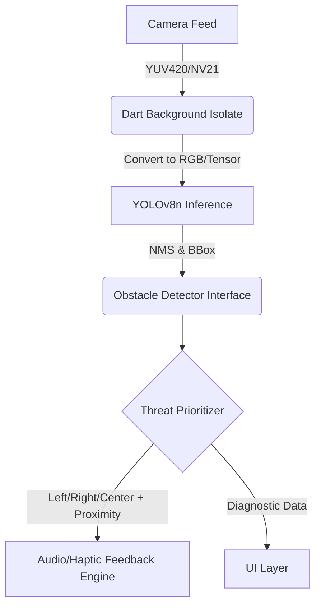

# Spatial Eye - Architecture

## System Design


## Modular Seams
The `ObstacleDetector` interface allows swapping ML models without changing the core application logic:
```dart
abstract class ObstacleDetector {
  Future<void> initialize();
  Stream<List<DetectedObstacle>> processFrame(CameraImage frame);
  Future<void> dispose();
}
```

## Background Dart Isolate
Heavy operations (image conversion, Tensor buffer creation, NMS calculation) run in a separate Dart Isolate to maintain 60 FPS UI rendering and prevent main thread jank.

## Adaptive Frame Throttling
Inference is throttled to run every 100-150ms to manage thermal output and battery consumption. If no significant scene shift occurs, throttling can dynamically adapt.

## State Management
`flutter_riverpod` (or `bloc`) manages application state:
- Camera Health
- Current Threat Level
- Active Settings (Quiet mode, etc.)
